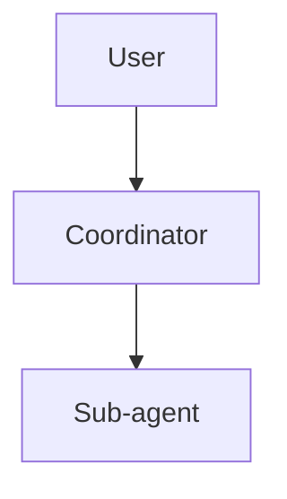

# ドキュメンテーション標準

## ファイル命名規則

### 設計書・計画書
- **フォーマット**: `{day番号}-{概要}.md`
- **例**:
  - `day5-coordinator-design.md`
  - `day6-7-multi-agent-implementation.md`
  - `week2-memory-system-design.md`

### 振り返り・レトロスペクティブ
- **フォーマット**: `{day番号}-retrospective.md`
- **例**:
  - `day3-retrospective.md`
  - `day5-retrospective.md`

### 技術仕様書
- **フォーマット**: `{番号}_{概要}.md`
- **例**:
  - `1_cli-foundation.md`
  - `2_agentic-loop-and-coordinator.md`
  - `3_memory-and-context.md`

### その他ドキュメント
- **README系**: `README.md`, `README-{topic}.md`
- **標準・規約**: `{NAME}_STANDARDS.md` (全て大文字)
  - `DOCUMENTATION_STANDARDS.md`
  - `TESTING_STANDARDS.md`
  - `CODE_STANDARDS.md`

## ドキュメント構造

### 設計書の必須セクション

```markdown
# Day X: {タイトル}

## 概要
{このフェーズで何を実現するか}

## 目標
- {具体的な目標1}
- {具体的な目標2}

## アーキテクチャ
{図やコードブロックで構造を説明}

## Step N: {ステップ名}

### 目的
{このステップの目的}

### 実装ファイル
- `path/to/file1.py`
- `path/to/file2.py`

### データ構造
```python
# コード例
```

### 実装のポイント
1. {ポイント1}
2. {ポイント2}

## テスト戦略
{テストの方針とファイル}

## 実装順序
1. {タスク1} (所要時間)
2. {タスク2} (所要時間)

## 成功基準
- [ ] {基準1}
- [ ] {基準2}

## 次のステップ
{次に何をするか}

## 参考資料
{関連ドキュメントへのリンク}
```

### 振り返りの必須セクション

```markdown
---
date: YYYY-MM-DD
phase: Day X 完了後の振り返り
---

# Day X 振り返り（{概要}）

## 実装内容
{何を実装したか}

## ✅ 良かった点
### {カテゴリ1}
- {詳細}

### {カテゴリ2}
- {詳細}

## ❌ 悪かった点・改善点
### {カテゴリ1}
- {問題点}
- {改善案}

## 📊 メトリクス
- テスト: {数値}
- カバレッジ: {数値}
- コミット数: {数値}

## 🎓 学んだこと
1. {教訓1}
2. {教訓2}

## 🔜 次のステップへの示唆
{次のフェーズで活かすべきこと}
```

## Frontmatter（メタデータ）

### 設計書
```yaml
---
tags:
  - implementation_plan
  - {topic}
phase: {week/day}
status: draft|in_progress|completed
---
```

### 振り返り
```yaml
---
date: YYYY-MM-DD
phase: Day X 完了後の振り返り
completed_steps:
  - step1
  - step2
---
```

## コードブロック規則

### 言語指定
必ず言語を指定する：
```python
# Python code
```

```bash
# Shell commands
```

```json
// JSON data
```

### ファイルパス表記
- 絶対パス: `src/ptsu_code/agent/runtime.py`
- 相対パス: `./docs/day5-coordinator-design.md`
- バッククォート必須: \`path/to/file.py\`

## リンク規則

### 内部リンク
- ドキュメント間: `[Day 3振り返り](./day3-retrospective.md)`
- セクション: `[アーキテクチャ](#アーキテクチャ)`

### 外部リンク
- 公式ドキュメント: `[OpenAI API](https://platform.openai.com/docs)`

## 図表規則

### ASCII図
```
User Input
    │
    ▼
┌─────────────┐
│ Component   │
└─────────────┘
```

### Mermaid（将来的に）


## バージョン管理

### ドキュメント更新時
- 大きな変更: 新しいファイルを作成（例: `day5-coordinator-design-v2.md`）
- 小さな修正: 既存ファイルを更新し、Frontmatterに更新日を追加

```yaml
---
created: 2026-04-07
updated: 2026-04-11
version: 1.1
---
```

## チェックリスト

### 設計書作成時
- [ ] 概要と目標が明確
- [ ] 実装ファイルパスが具体的
- [ ] コード例が含まれている
- [ ] テスト戦略が定義されている
- [ ] 成功基準が測定可能
- [ ] 次のステップが明記されている

### 振り返り作成時
- [ ] 実装内容が網羅されている
- [ ] 良い点と悪い点が具体的
- [ ] メトリクスが記録されている
- [ ] 次への示唆が含まれている

## 命名の一貫性

### 用語統一
- **Sub-agent** (not sub_agent, subagent)
- **Coordinator** (not coordinator_mode)
- **Intent分類器** (not Intent Classifier, 意図分類器)
- **ツール** (not Tool, tool)
- **プロンプト** (not Prompt, prompt)

### 日英混在ルール
- 技術用語: 英語（Agent, Runtime, Provider）
- 説明文: 日本語
- コード内: 英語のみ
- ドキュメント: 日本語優先、技術用語は英語

## 例

### ✅ 良い例
```markdown
# Day 5: Coordinator Mode 設計書

## Step 6: Sub-agent Protocol 定義

### 実装ファイル
- `src/ptsu_code/agent/sub_agents/base.py`

### データ構造
```python
class AgentRole(Enum):
    SEARCHER = "searcher"
```
```

### ❌ 悪い例
```markdown
# day5設計

## sub agent protocol

ファイル: base.py

class AgentRole(Enum):
    SEARCHER = "searcher"
```

## 更新履歴

- 2026-04-11: 初版作成
